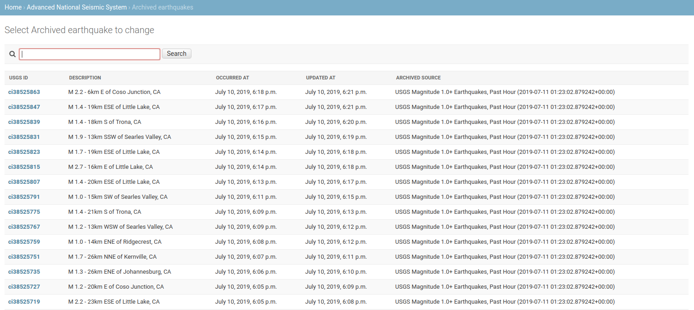
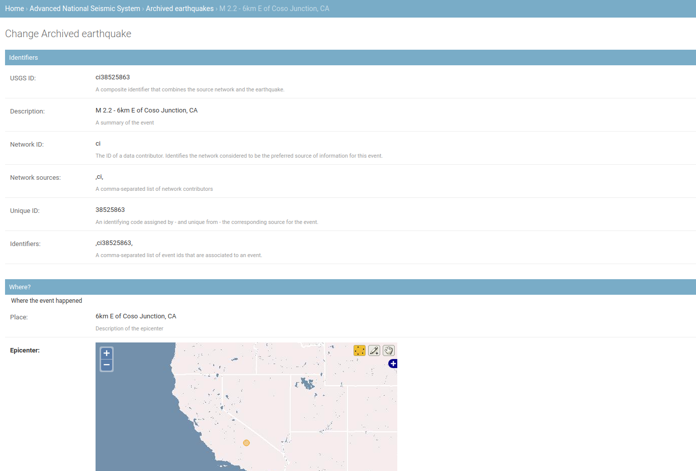

# django-anss-archive

A Django application to archive real-time earthquake notifications from the [U.S. Geological Survey's Advanced National Seismic System](https://earthquake.usgs.gov/earthquakes/feed/)

## Requirements

- The [Django web framework](https://www.djangoproject.com/)
- A geospatial database like [PostGIS](https://postgis.net/)

## Getting started

Install the Python package.

```bash
pipenv install django-anss-archive
```

Add to Django's INSTALLED_APPS.

```python
INSTALLED_APPS = ("anss",)
```

Run migrations to create database tables.

```bash
python manage.py migrate
```

## Usage

Run the archive command to save all earthquakes in the latest hour greater than 1.0 magnitude.

```bash
python manage.py getlatestanssfeed
```

Start your test server and visit the admin to see the results.

```bash
python manage.py runserver
```

It includes a list of all the earthquakes.



And lots of data about each one.



## Other resources

* Code: [github.com/datadesk/django-anss-archive](https://github.com/datadesk/django-anss-archive/)
* Issues: [github.com/datadesk/django-anss-archive/issues](https://github.com/datadesk/django-anss-archive/issues)
* Packaging: [pypi.python.org/pypi/django-anss-archive](https://pypi.python.org/pypi/django-anss-archive)
* Testing: [github.com/datadesk/django-anss-archive/actions](https://github.com/datadesk/django-anss-archive/actions)
